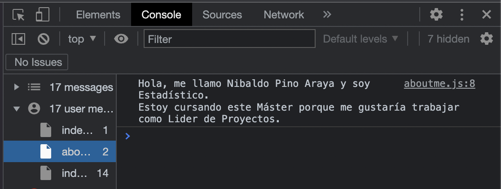

# Actividad Sesion 1
## Soluciones 1

### Ejercicio 1

```javascript
//file aboutme.js
let name = "Nibaldo Pino Araya";
let profession = "Estadístico";
let work = "Lider de Proyectos";

let aboutMe = `Hola, me llamo ${name} y soy ${profession}.
Estoy cursando este Máster porque me gustaría trabajar como ${work}.`;

console.log(aboutMe);
```

Importando el archivo `aboutme.js` en `index.js`


Salida por consola del archivo `index.js`



### Ejercicio 2

Como el archivo `index.js` importa el fichero `aboutme.js` este se ejecuta inicialmente.


### Ejercicio 3

- **elements**: Permite inspeccionar los elementos que componen la web.
- **console**: Permite ver el log de mensajes de salida.
- **source**: Permite ver archivos, ejecutar fragmentos, depurar codigo.
- **network**: Permite inspeccionar la actividad de la red, como recursos cargados o descargados.
- **performance**: Permite analizar el tendimiento del tiempo de ejecución.
- **memory**: Permite analizar el uso de la memoria y crear/gestionar perfiles de memoria.

### Ejercicio 4

```javascript
const  multiplos_7 = (number) =>{
    let  multiplos = [];
    for (let i = 0; i <= 100; i++){
        if (i%7 == 0){
            multiplos.push(i);
        }
    }
    return multiplos;
};

console.log(multiplos_7(100));
```

Salida por consola de fichero `index.js`


### Ejercicio 5

El tag `<script type=”module”>` corresponde a la declarativa del modo estricto, es decir, indica que contiene un script de modulo el cual puede usar import, export, y stos modulos se ejecutan una vez.

### Ejercicio 6

```javascript
// declarativa del objeto constructor
function formatter() {
    this.prefix = "Hello";
    this.append = function(phrase){
        console.log(`${this.prefix} ${phrase}`);
    }
};

// instancia del objeto tipo formatter
let myFormatter = new formatter();
myFormatter.append("Nibaldo");

// agregando metodo via prototype
formatter.prototype.LowerPhrase = function(OtherPhrase){
    console.log(OtherPhrase.toLowerCase());
};

// salida por consola
myFormatter.LowerPhrase("Hola Nibaldito, como estas?");
```